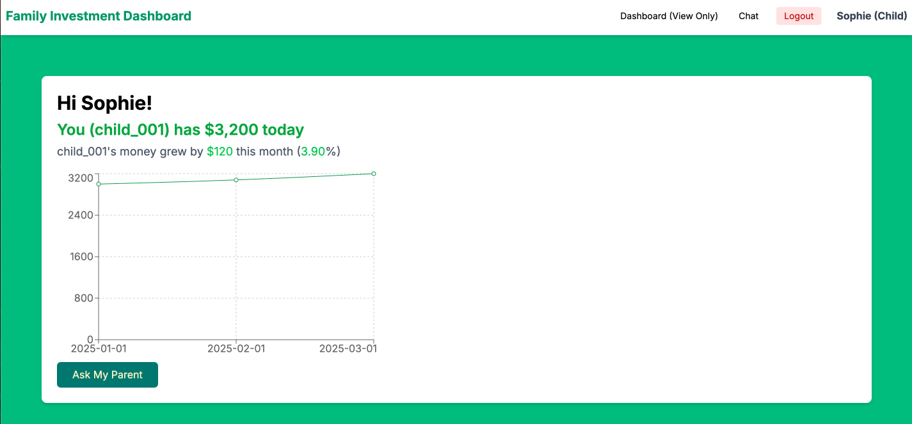
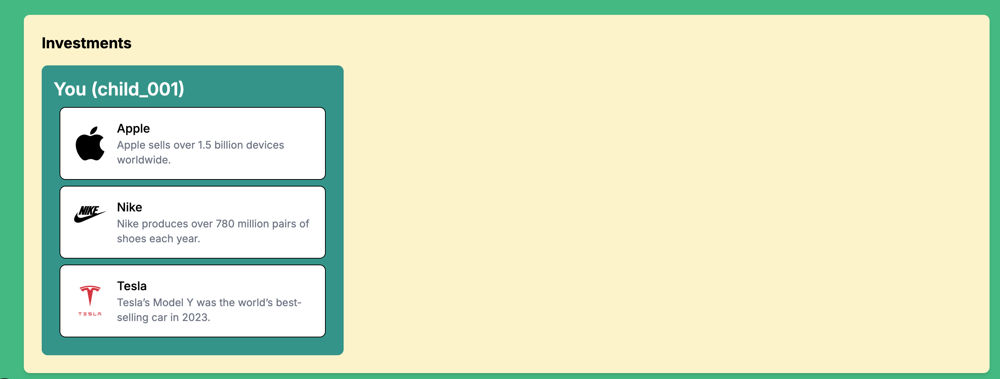
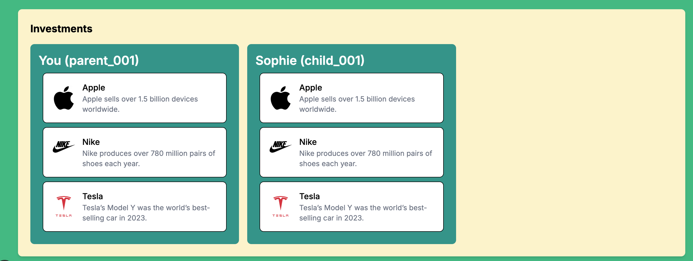
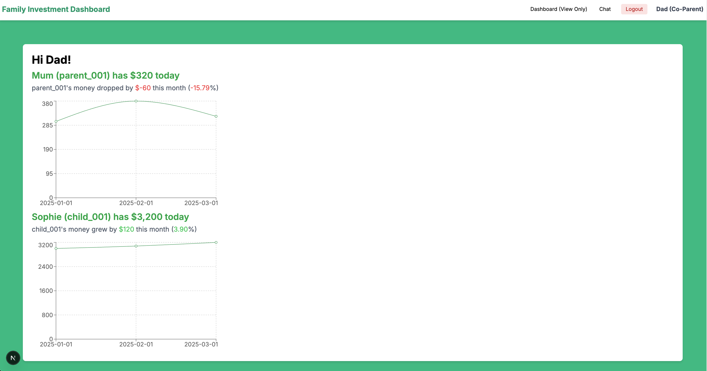
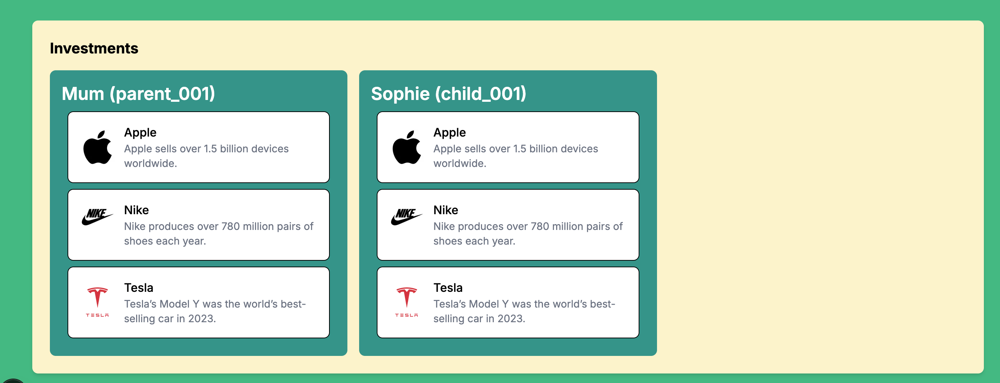

# Family Investment Dashboard

## Overview

This project is a prototype for a family investment dashboard designed to provide a child-friendly experience. It includes a view-only investment dashboard for children and a family group chat feature shared among parents, co-parents, and children.

## 🎯 Goal

Create a working prototype of a child’s investment dashboard that pulls mock investment data, displays it in a simple, engaging format, and includes a family group chat feature shared across parent, co-parent, and child user

### 👥 User Roles

- **Parent**: Full access to data and chat.
- **Child**: View-only dashboard with chat access.
- **Co-Parent**: View-only access and chat access.

### MVP Features

1. **Login Page**

   - Role selector for parent, child, and co-parent.
   - Dummy username field.
   - Routes to the appropriate view upon login.
     

2. **Child Dashboard (view-only)**

   - Displays total investment value.
   - Shows monthly change in investment.
   - Includes a simple growth chart using dummy data.
   - Lists the related brands with logos.
   - "Ask My Parent" button to open group chat.
     
     

3. **Parent Dashboard (full-access)**
   
   

4. **Co-Parent Dashboard (view-only)**
   
   

5. **Family Group Chat**
   - Shared chat view for all users.
   - Displays sender's role and timestamp.
   - Supports basic styling and emojis.

## Tech Stack

- **Frontend**: Next.js
- **Backend**: Next.js
- **Mock Data**: JSON files or in-memory storage (local storage)
- **UI**: Tailwind CSS

## 📦 Folder Structure (Next.js)

```
MVP-INVEST-DASHBOARD
├── app
│   ├── api
│   │   ├── chat
│   │   │  └── route.ts
│   │   ├── family
│   │   │  └── route.ts
│   │   ├── investment
│   │   │  └── route.ts
│   │   └── portfolio
│   │      └── route.ts
│   ├── chat
│   │   └── page.tsx
│   ├── dashboard
│   │   └── page.tsx
│   ├── favicon.ico
│   ├── globals.css
│   ├── layout.tsx
│   └── page.tsx
├── components
│   ├── ChatInterface.tsx
│   ├── Header.tsx
│   ├── InvestmentDashboard.tsx
│   ├── Investments.tsx
│   ├── LoginForm.tsx
│   └── Porfolios.tsx
├── lib
│   ├── context
│   │   └── AuthContext.tsx
│   ├── mock-data
│   │   ├── chatMessages.json
│   │   ├── familyGroups.json
│   │   ├── investments.json
│   │   └── portfolio.json
│   ├── types
│   │   └── index.ts
│   └── apiService.ts
└── README.md
```

## 🚀 Setup Instructions

```
git clone https://github.com/siewla/mvp-invest-dashboard.git
cd mvp-invest-dashboard
npm i
npm run dev
```

### Deliverables

• ✅ Working codebase (frontend + backend)
• ✅ README with setup instructions
• ✅ GitHub repo (https://github.com/siewla/mvp-invest-dashboard#)
• ✅ Live demo link (Netlify, Vercel, etc.)
